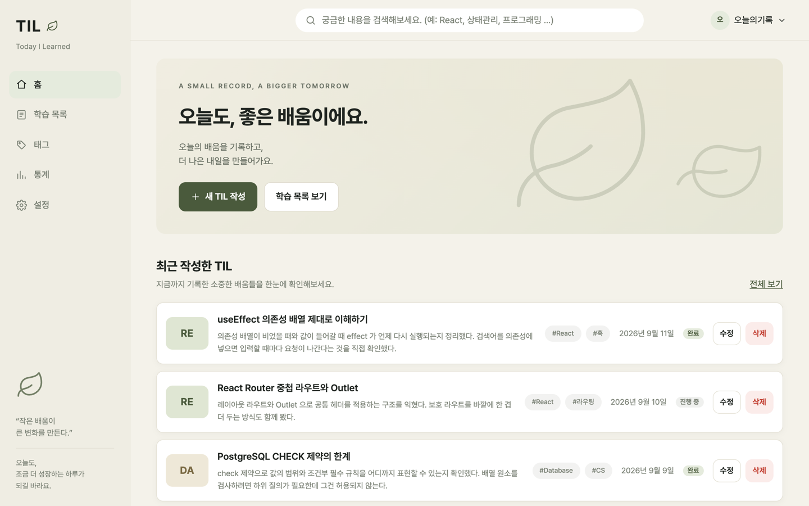
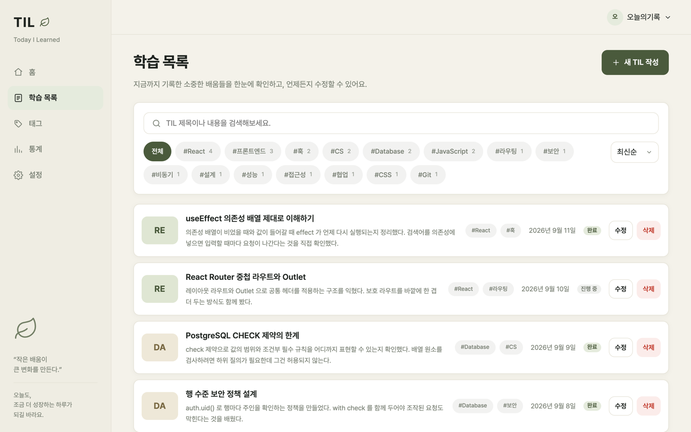
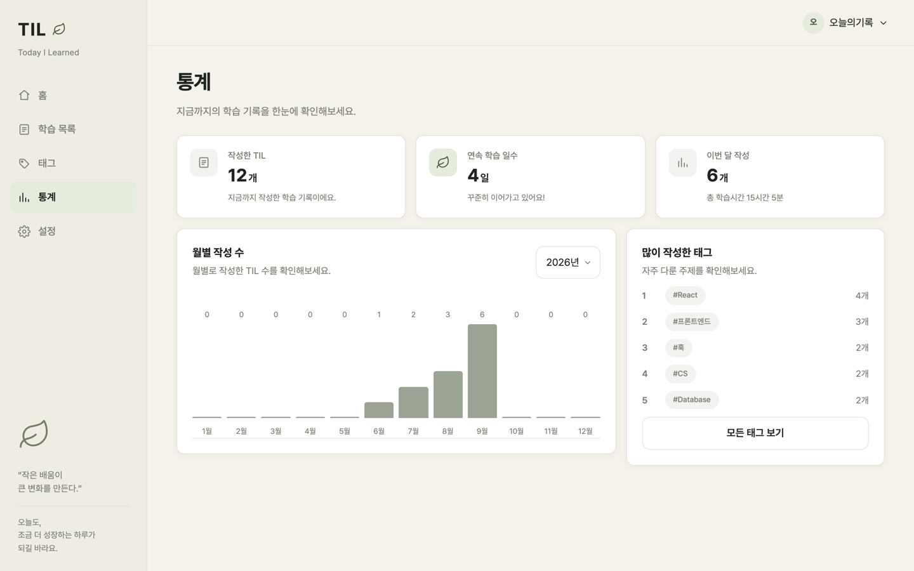

# TIL — Today I Learned

오늘 배운 것을 기록하고, 태그로 모아 보고, 회고와 함께 완료로 남기는 학습 기록 서비스입니다.

공부한 내용을 적어 두기만 하면 다시 열어보지 않게 됩니다. 이 서비스는 기록을 남길 때 **학습 시간과 이해도를 함께 받고, 완료로 표시하려면 회고를 요구합니다.** 무엇을 얼마나 했는지가 통계로 쌓이고, 태그로 어떤 주제에 시간을 썼는지 보입니다.

| | |
|---|---|
| **배포** | **https://b1-2-b0e2s-projects.vercel.app** |
| 저장소 | https://github.com/b0e2/b1-2 |
| 시연 계정 | `demo@til.local` / `demo1234!` |



| 학습 목록 | 통계 |
|---|---|
|  |  |

---

## 목차

[시작하기](#시작하기) · [기술 구성](#기술-구성) · [화면과 라우팅](#화면과-라우팅) · [데이터](#데이터) · [구조](#구조) · [데이터를 다루는 방법](#데이터를-다루는-방법) · [폼](#폼) · [상태가 화면으로](#상태가-화면으로) · [성능](#성능) · [배포](#배포)

---

## 시작하기

```bash
npm install
cp .env.example .env    # 아래 두 값을 채웁니다
npm run dev             # http://localhost:5173
```

| 환경변수 | 설명 |
|---|---|
| `VITE_SUPABASE_URL` | Supabase 프로젝트 주소 |
| `VITE_SUPABASE_ANON_KEY` | 브라우저에 노출되는 공개 키 |

Vite 는 `VITE_` 로 시작하는 값만 브라우저 코드에 넣습니다. 이름이 다르면 값이 비어 실행 중에 실패하므로, 시작 시점에 확인하고 없으면 바로 멈춥니다.

```js
// src/lib/supabaseClient.js
if (!url || !anonKey) {
  throw new Error('Supabase 환경변수가 없습니다. .env 에 VITE_SUPABASE_URL 과 VITE_SUPABASE_ANON_KEY 를 설정하세요.')
}
```

비밀 키는 브라우저에 넣지 않습니다. 공개 키만 쓰고 데이터 보호는 데이터베이스의 접근 정책이 맡습니다.

데이터베이스는 `supabase/schema.sql` 을 SQL Editor 에 실행해 만듭니다. 스키마를 바꾼 이력과 실행 순서는 `supabase/migrations/README.md` 에 있습니다.

```bash
npm run build     # 배포용 빌드
npm run preview   # 빌드 결과 미리보기
npm run lint      # 정적 검사
```

---

## 기술 구성

| 영역 | 선택 |
|---|---|
| 화면 | React 19 + Vite |
| 라우팅 | React Router |
| 데이터 · 인증 | Supabase (PostgreSQL) |
| 배포 | Vercel |
| 스타일 | 일반 CSS |

Supabase 를 고른 이유는 다루는 데이터가 한 종류이고, **값의 범위와 조건을 테이블 제약으로 그대로 표현할 수 있기** 때문입니다. 학습 시간 5~720분, 이해도 1~5, 완료 상태면 회고 필수 같은 규칙이 스키마에 남습니다. 인증도 같은 데이터베이스 안에 있어 사용자 식별과 접근 정책이 바로 이어집니다.

상태 관리 라이브러리와 데이터 조회 라이브러리는 쓰지 않았습니다. 무엇을 언제 요청하고 그 결과를 어떤 상태로 둘지 직접 정하는 것이 이 프로젝트의 목적입니다.

---

## 화면과 라우팅

라우트는 9개와 Not Found 입니다. 구조가 3중인데, 바깥부터 **로그인 확인 → 공통 레이아웃 → 각 화면** 순입니다.

```jsx
// src/App.jsx
<Routes>
  <Route element={<ProtectedRoute />}>
    <Route element={<AppLayout />}>
      <Route path="/" element={<DashboardPage />} />
      <Route path="/logs" element={<StudyLogsPage />} />
      <Route path="/logs/new" element={<NewStudyLogPage />} />
      <Route path="/logs/:id" element={<StudyLogDetailPage />} />
      <Route path="/logs/:id/edit" element={<EditStudyLogPage />} />
      <Route path="/tags" element={<TagsPage />} />
      <Route path="/stats" element={<StatsPage />} />
      <Route path="/settings" element={<SettingsPage />} />
    </Route>
  </Route>
  <Route path="/login" element={<LoginPage />} />
  <Route path="*" element={<NotFoundPage />} />
</Routes>
```

로그인 화면과 Not Found 만 보호 바깥에 있습니다. 사이드바가 필요 없는 화면이기도 합니다. 사이드바의 `NavLink` 다섯 개(홈·학습 목록·태그·통계·설정)가 주요 화면을 잇고, 우상단 사용자 버튼이 설정으로 갑니다.

**"없는 주소"는 두 가지로 나눴습니다.**

- `/아무거나` → 라우터의 `*` 가 잡아 Not Found 화면
- `/logs/존재하지않는-uuid` → 상세 화면의 "기록을 찾을 수 없습니다"

주소 형식은 맞는데 그 데이터가 없는 경우는 다른 상황이라 구분합니다. `useStudyLog` 이 0행을 오류와 따로 구분하기 때문에 가능합니다.

```js
} else if (!data) {
  // 주소는 올바른데 해당 기록이 없는 경우다.
  setIsNotFound(true)
}
```

목록과 태그 화면도 역할이 다릅니다. **태그 화면은 어떤 주제를 얼마나 다뤘는지만 보여주고**, 실제 기록은 학습 목록으로 넘겨 그 화면의 필터로 봅니다. 같은 목록이 두 화면에 있으면 어느 쪽을 봐야 할지 알 수 없기 때문입니다.

---

## 데이터

핵심 데이터는 `study_logs` 한 테이블입니다.

| 컬럼 | 타입 | 제약 |
|---|---|---|
| `id` | uuid | 기본키 |
| `user_id` | uuid | 작성자. 접근 정책의 기준 |
| `title` | text | 공백 제외 2~80자 |
| `tags` | text[] | 1~5개, 빈 값 불가 |
| `study_date` | date | 오늘 이하 |
| `duration_minutes` | integer | 5~720 |
| `understanding` | smallint | 1~5 |
| `content` | text | 공백 제외 10~3000자 |
| `reflection` | text | 완료 상태면 10자 이상 필수 |
| `resource_url` | text | 선택. 입력 시 http(s) 주소 |
| `is_completed` | boolean | 기본 false |
| `created_at` `updated_at` | timestamptz | |

태그는 배열 컬럼에 두고 개수와 순위는 기록에서 계산합니다. 태그를 따로 저장하면 기록을 지울 때 개수를 함께 줄여야 하고 어긋나면 맞출 방법이 없지만, 계산하면 어긋날 수가 없습니다. 각 태그의 색은 이름을 해시해서 정해 같은 태그가 언제나 같은 색을 갖습니다.

### 접근 정책

행마다 `user_id` 를 확인합니다.

```sql
-- supabase/migrations/20260911_user_scoped_rls.sql
create policy auth_select_study_logs
  on public.study_logs for select to authenticated
  using (auth.uid() = user_id);

create policy auth_update_study_logs
  on public.study_logs for update to authenticated
  using (auth.uid() = user_id)
  with check (auth.uid() = user_id);
```

등록과 수정에 `with check` 를 함께 둔 것이 요점입니다. **화면을 조작해 다른 사람의 식별자를 보내도 데이터베이스가 거부합니다.**

### 검증이 놓인 자리

같은 규칙이 두 군데에 있습니다. `lib/studyLogValidation.js` 의 순수 함수와 테이블의 `check` 제약입니다.

```sql
-- supabase/schema.sql
constraint study_logs_duration_range
  check (duration_minutes between 5 and 720),
constraint study_logs_completed_requires_reflection
  check (
    is_completed = false
    or (reflection is not null and char_length(btrim(reflection)) >= 10)
  )
```

화면 검증은 사용자가 실수를 바로 알아차리게 하는 것이고, **실제 보장은 데이터베이스에 있습니다.** 화면을 건너뛰고 직접 요청을 보내도 완료 상태인데 회고가 없는 기록은 저장되지 않습니다.

---

## 구조

```
src/
├── pages/            라우트 하나에 화면 하나
├── components/
│   ├── ui/           기록이 무엇인지 모름
│   └── study-logs/   기록 객체를 앎
├── hooks/            언제 요청할지, 결과를 어떤 상태로 둘지
├── lib/              이 값이 올바른가 · 어떻게 보일까 · 무엇을 계산할까
├── contexts/         로그인한 사용자, 테마
└── styles/           토큰 → 기본값 → 레이아웃 → 공용 → 도메인 → 화면
```

컴포넌트는 **기록을 아는가**로 나눴습니다. `ui/` 안의 것들은 `log` 가 무엇인지 모르고 값과 콜백만 받아 다른 프로젝트에 그대로 옮길 수 있습니다. `study-logs/` 안의 것들은 기록 객체를 받으며 이 서비스를 벗어나면 쓸 수 없습니다.

재사용 컴포넌트는 13개이고 전부 prop 에 따라 표시나 동작이 달라집니다.

| 컴포넌트 | 받는 prop |
|---|---|
| `Button` | `variant` `size` `type` `disabled` `isLoading` `loadingLabel` `onClick` |
| `PageHeader` | `title` `description` `action` |
| `FormField` | `id` `label` `required` `error` `hint` `count` |
| `TextField` | `as` `name` `label` `value` `error` `hint` `count` `options` |
| `LoadingState` | `message` `size` |
| `ErrorState` | `title` `message` `onRetry` |
| `EmptyState` | `title` `description` `actionLabel` `onAction` |
| `ConfirmDialog` | `open` `title` `description` `confirmLabel` `tone` `isProcessing` `error` `onConfirm` `onCancel` |
| `StatusBadge` | `isCompleted` `size` |
| `TagBadge` | `tag` `label` `count` `selected` `size` `onClick` |
| `StatCard` | `icon` `label` `value` `unit` `description` `tone` |
| `StudyLogCard` | `log` `compact` `isDeleting` `onEdit` `onDelete` |
| `StudyLogForm` | `values` `errors` `touched` `isSubmitting` `submitError` `submitLabel` `today` `tagSuggestions` `onChange` `onBlur` `onTagsChange` `onSubmit` `onCancel` |

`AppLayout` `Sidebar` `Header` 는 세지 않았습니다. prop 없이 항상 같은 것을 그리기 때문입니다.

**억지로 나누지 않은 사례도 있습니다.** 카드를 반복만 하는 `StudyLogList` 를 만들었다가 지웠습니다. `logs.map()` 이면 충분하고, 그런 컴포넌트는 파일만 늘고 왜 나눴는지 답할 것이 없습니다.

계층은 **React 가 필요한가**로 나눴습니다. `lib/` 에는 같은 입력에 같은 결과를 내는 함수만 두어서 검증 규칙을 확인하려고 화면을 띄울 필요가 없습니다. 컴포넌트는 데이터를 직접 조회하지 않고 훅은 마크업을 돌려주지 않습니다.

---

## 데이터를 다루는 방법

### 훅으로 나눈 기준

| 훅 | 하는 일 | effect 의존성 |
|---|---|---|
| `useStudyLogs()` | 목록 조회, 삭제 | `[reloadKey]` |
| `useStudyLog(id)` | 단건 조회, 수정, 삭제, 완료 전환 | `[id, reloadKey]` |
| `useCreateStudyLog()` | 등록 | 조회 없음 |
| `useStudyLogForm()` | 입력 상태와 제출 흐름 | 없음 |

목록과 단건을 나눈 것은 **생명주기가 다르기** 때문입니다. 목록은 화면에 들어올 때 한 번 부르면 되지만, 상세는 주소의 식별자가 바뀔 때마다 다시 불러야 합니다. 한 훅에 넣으면 의존성 배열이 서로 다른 두 흐름이 섞입니다.

그리고 네 화면(`/`, `/logs`, `/tags`, `/stats`)이 같은 조회를 합니다. 화면마다 적으면 요청·중단·오류 처리가 네 번 복제됩니다.

### 조회 — 정리까지

```js
// src/hooks/useStudyLogs.js
useEffect(() => {
  const controller = new AbortController()
  let active = true

  async function loadStudyLogs() {
    setIsLoading(true)
    setError(null)

    const { data, error: requestError } = await supabase
      .from(STUDY_LOGS_TABLE).select('*')
      .order('study_date', { ascending: false })
      .abortSignal(controller.signal)

    // 화면을 벗어났거나 재조회로 이 요청이 밀려난 경우다.
    // 중단은 사용자 잘못이 아니므로 오류로 표시하지 않는다.
    if (!active || controller.signal.aborted) return

    if (requestError) { setError(requestError); setLogs([]) }
    else setLogs(data ?? [])
    setIsLoading(false)
  }

  loadStudyLogs()
  return () => { active = false; controller.abort() }
}, [reloadKey])
```

`useStudyLog(id)` 은 의존성이 `[id, reloadKey]` 라 식별자가 바뀔 때마다 다시 돌고, 그때 이전 요청을 중단합니다. 그러지 않으면 A 를 열었다 빠르게 B 로 넘어갈 때 늦게 도착한 A 의 응답이 B 화면을 덮습니다.

**가장 중요한 건 의존성에 넣지 않은 것입니다.** 검색어·태그·정렬은 여기 없습니다. 넣었다면 한 글자 칠 때마다 요청이 나갔을 것입니다. 이 값들은 주소에 두고 화면에서 배열을 거르는 데만 씁니다.

### 등록

```js
// src/hooks/useStudyLog.js
// 주인은 화면 입력값에서 받지 않는다. 지금 로그인한 사용자로 정한다.
const createLog = useCallback(async (values) => {
  const { data: auth } = await supabase.auth.getUser()
  setIsCreating(true)

  const { data, error } = await supabase
    .from(STUDY_LOGS_TABLE)
    .insert({ ...values, user_id: auth?.user?.id ?? null })
    .select().single()

  setIsCreating(false)
  if (error) throw new Error('저장하지 못했습니다. 입력값을 확인하고 다시 시도해 주세요.')
  return data
}, [])
```

### 수정 — 서버가 돌려준 행으로 교체

```js
const applyUpdate = useCallback(async (payload) => {
  setIsUpdating(true)
  const { data, error } = await supabase
    .from(STUDY_LOGS_TABLE).update(payload).eq('id', id).select().single()

  setIsUpdating(false)
  if (error) { setMutationError('저장하지 못했습니다. 잠시 후 다시 시도해 주세요.'); return null }

  // 서버가 돌려준 행으로 교체한다. 화면의 값과 저장된 값이 갈리지 않게 한다.
  setLog(data)
  return data
}, [id])
```

### 삭제 — 성공한 뒤에만 지움

```js
// src/hooks/useStudyLogs.js
const { error: requestError } = await supabase
  .from(STUDY_LOGS_TABLE).delete().eq('id', targetId)

if (requestError) {
  setMutationError('삭제하지 못했습니다. 잠시 후 다시 시도해 주세요.')
  return false
}
setLogs((current) => current.filter((log) => log.id !== targetId))
```

먼저 지우면 실패했을 때 사라진 행을 되살려야 합니다.

### 화면마다 따로 부르는 이유

홈·학습 목록·태그·통계가 각자 `useStudyLogs()` 를 호출합니다. 하나로 합쳐 전역에 두지 않았습니다.

합치면 화면마다 갖고 있던 **불러오는 중과 실패 상태가 하나가 됩니다.** 통계에서 실패했을 때 목록도 실패한 것처럼 보이고, 어느 화면에서 다시 시도할지도 애매해집니다. 다루는 데이터가 적어 요청이 겹치는 비용보다 상태가 섞이지 않는 이점이 큽니다.

전역 상태에는 로그인한 사용자와 테마만 둡니다. 둘 다 화면 전체가 함께 바뀌어야 하는 값입니다.

### 비동기 상태를 판정하는 순서

모든 조회 화면이 같은 순서를 지킵니다.

```jsx
// src/pages/StudyLogsPage.jsx
function renderBody() {
  if (isLoading) return <LoadingState message="TIL을 불러오는 중입니다." />

  if (error) {
    return <ErrorState message="TIL을 불러오지 못했습니다. 잠시 후 다시 시도해 주세요." onRetry={refetch} />
  }

  // 아직 하나도 없는 경우와 조건에 맞는 것이 없는 경우는 다른 상황이다.
  if (logs.length === 0) {
    return <EmptyState title="아직 작성한 TIL이 없습니다." actionLabel="새 TIL 작성" onAction={...} />
  }

  if (visibleLogs.length === 0) {
    return <EmptyState title="조건에 맞는 TIL이 없습니다." actionLabel="조건 초기화" onAction={...} />
  }

  return <ul className="log-list">{visibleLogs.map((log) => <StudyLogCard ... />)}</ul>
}
```

같은 세 컴포넌트를 `DashboardPage` `TagsPage` `StatsPage` 도 같은 순서로 씁니다. `EmptyState` 하나가 데이터 없음·검색 결과 없음·태그 결과 없음·상세 기록 없음 네 가지 의미로 쓰이고, 문구와 액션만 prop 으로 달라집니다.

### props 와 state

`StudyLogCard` 는 **자기 상태가 하나도 없습니다.** 기록과 콜백만 받고, 삭제를 누르는 것도 `onDelete(log)` 로 위로 올립니다. 어떻게 처리할지는 화면이 정합니다.

상태는 **그것이 필요한 가장 얕은 곳**에 둡니다.

| 상태 | 어디에 | 왜 |
|---|---|---|
| 검색어·태그·정렬 | 주소 | 새로고침·뒤로가기·링크 공유가 되어야 함 |
| 입력 중인 검색어 | 화면 로컬 | 제출 전까지 주소를 바꿀 필요가 없음 |
| 삭제 대상 | 화면 로컬 | 이 화면을 벗어나면 의미가 없음 |
| 기록 목록 | 훅 | 원격 데이터라 요청·오류와 묶여야 함 |
| 로그인 사용자·테마 | 전역 | 화면 전체가 함께 바뀜 |

---

## 폼

등록과 수정이 같은 `StudyLogForm` 을 씁니다. 값과 오류를 모두 바깥에서 받고 Supabase 를 모르기 때문에 가능합니다. 복제했다면 검증 규칙이 두 벌이 됐을 것입니다.

제출 흐름입니다.

```js
// src/hooks/useStudyLogForm.js
async function handleSubmit(event) {
  event.preventDefault()
  if (isSubmitting) return // 연속 클릭이 두 번째 요청을 만들지 않게 한다.

  const nextErrors = validateStudyLog(values, { today })
  setErrors(nextErrors)
  setTouched(Object.fromEntries(Object.keys(values).map((key) => [key, true])))

  if (Object.keys(nextErrors).length > 0) {
    const [firstField] = Object.keys(nextErrors)
    document.getElementById(firstField)?.focus()
    return
  }

  setIsSubmitting(true)
  setSubmitError('')

  try {
    await onSubmit(normalizeStudyLogInput(values))
  } catch (error) {
    // 실패해도 입력값은 그대로 둔다. 다시 쓰게 만들지 않는다.
    setSubmitError(error?.message || '저장에 실패했습니다. 잠시 후 다시 시도해 주세요.')
  } finally {
    setIsSubmitting(false)
  }
}
```

**중복 차단이 두 겹입니다.** 버튼에 `disabled` 를 걸고, 함수 진입부에서도 막습니다. 버튼만 막으면 입력칸에서 엔터를 연타할 때 뚫립니다.

```jsx
<Button type="submit" variant="primary" isLoading={isSubmitting} loadingLabel="저장 중">
```

오류는 각 입력 아래에 붙고 `aria-describedby` 로 연결됩니다. **아직 건드리지 않은 필드는 보여주지 않습니다** — 폼을 열자마자 빨간 글씨가 가득하면 읽히지 않습니다.

```js
const shown = (name) => (touched[name] ? errors[name] : undefined)
```

---

## 상태가 화면으로

### 완료 전환 — 한 번의 원격 변경이 네 곳을 바꿈

```jsx
// src/pages/StudyLogDetailPage.jsx
const updated = await toggleComplete(reflection)
```

`toggleComplete` 이 서버가 돌려준 행으로 `log` 를 교체하면, 이 값을 읽던 네 곳이 함께 다시 그려집니다.

```jsx
<StatusBadge isCompleted={log.is_completed} />        {/* 배지 문구 */}
<dd>{log.is_completed ? '완료' : '진행 중'}</dd>        {/* 요약 카드 */}
{log.reflection ? <p>{log.reflection}</p> : <p>아직 회고가 없습니다…</p>}
{log.is_completed ? <Button>완료 취소</Button> : <Button>학습 완료로 표시</Button>}
```

규칙은 `lib` 한 곳에 있고 목록 훅도 같은 함수를 씁니다. 각자 구현하면 화면마다 회고 조건이 갈립니다.

```js
// src/lib/studyLogValidation.js
export function buildCompletionPayload(log, reflection) {
  const nextCompleted = !log.is_completed
  if (!nextCompleted) {
    // 완료를 되돌릴 때는 회고를 지우지 않는다. 다시 완료할 때 그대로 쓴다.
    return { payload: { is_completed: false, updated_at: ... }, error: '' }
  }
  const text = String(reflection ?? log.reflection ?? '').trim()
  const error = validateReflection(text, true)
  if (error) return { payload: null, error }
  return { payload: { is_completed: true, reflection: text, updated_at: ... }, error: '' }
}
```

### 검색·태그·정렬 — 주소가 바뀌면 목록이 바뀜

```jsx
// src/pages/StudyLogsPage.jsx
const { query, tag, sort } = readLogSearchParams(searchParams)

const visibleLogs = useMemo(
  () => sortStudyLogs(filterStudyLogs(logs, { query, tag }), sort),
  [logs, query, tag, sort],
)
```

주소가 바뀌면 `visibleLogs` 가 다시 계산되고 카드 목록·결과 건수·필터 빈 상태·칩 선택 표시가 함께 바뀝니다. **네트워크 요청은 없습니다.** 개발자도구 Network 탭을 열고 타이핑하면 확인됩니다.

### 폼 입력 — 체크 하나가 검증 규칙을 바꿈

"학습을 마쳤어요"를 체크하면 `values.is_completed` 가 바뀌고, 그 값을 읽는 세 곳이 반응합니다.

```jsx
<TextField
  {...common('reflection')}
  label="회고"
  required={values.is_completed}
  hint={values.is_completed ? '완료로 표시하려면 10자 이상 적어주세요.' : '선택 항목입니다.'}
/>
```

필수 표시가 붙고, 힌트 문구가 바뀌고, `validateReflection(value, isCompleted)` 의 판정이 달라집니다.

### 한 기능의 전체 흐름

기록을 완료로 바꾸는 과정을 처음부터 끝까지 보면 이렇습니다.

```
① 라우팅    /logs/:id 진입
            App.jsx 의 ProtectedRoute 가 세션 확인
            AppLayout 안에서 StudyLogDetailPage 마운트

② 상태      const { id } = useParams()
            useStudyLog(id) 의 effect 가 [id] 로 실행 → 원격 조회
            isLoading=true → <LoadingState />

③ 렌더링    응답 도착 → setLog(data) → 상세 화면

④ 이벤트    "학습 완료로 표시" 클릭
            → setDialog('complete') → ConfirmDialog 열림
            → 회고 입력 → 확인

⑤ 상태      toggleComplete(reflection)
            → buildCompletionPayload 가 회고 10자 검사
            → 통과하면 Supabase update
            → setLog(서버가 돌려준 행)

⑥ 렌더링    log.is_completed 가 바뀌며
            배지·버튼·요약 카드·회고 영역이 동시에 다시 그려짐
```

---

## 성능

화면을 필요할 때 받아옵니다. 라이브러리는 앱 코드와 나눠 두어 화면을 고쳐 배포해도 다시 받지 않습니다.

```
index.js      12 kB   앱 코드
react.js     230 kB   거의 바뀌지 않음
supabase.js  203 kB   거의 바뀌지 않음
각 화면      1~5 kB   열 때 받음
```

목록 카드는 `memo` 로 감쌌습니다. 검색어를 칠 때마다 화면이 다시 그려지지만 카드 내용은 바뀌지 않기 때문입니다. 다만 `memo` 만으로는 부족합니다 — 넘기는 함수가 매 렌더마다 새로 만들어지면 props 가 계속 달라져 무효가 됩니다.

```js
const goEdit = useCallback((item) => navigate(`/logs/${item.id}/edit`), [navigate])
```

파생 계산에만 `useMemo` 를 씁니다. 비싸서가 아니라 원본 상태와 계산 결과를 구분하기 위해서입니다.

---

## 배포

Vercel 에 올립니다. 화면 전환을 브라우저 안에서 하므로 상세 주소를 직접 열면 서버가 그런 파일을 찾지 못합니다.

```json
// vercel.json
{ "rewrites": [{ "source": "/(.*)", "destination": "/index.html" }] }
```

배포 환경에도 같은 두 환경변수를 등록해야 합니다. 값이 없으면 빌드는 성공하지만 화면이 뜨지 않습니다.

로그인 시연을 위해 Supabase 의 메일 확인을 껐습니다.
